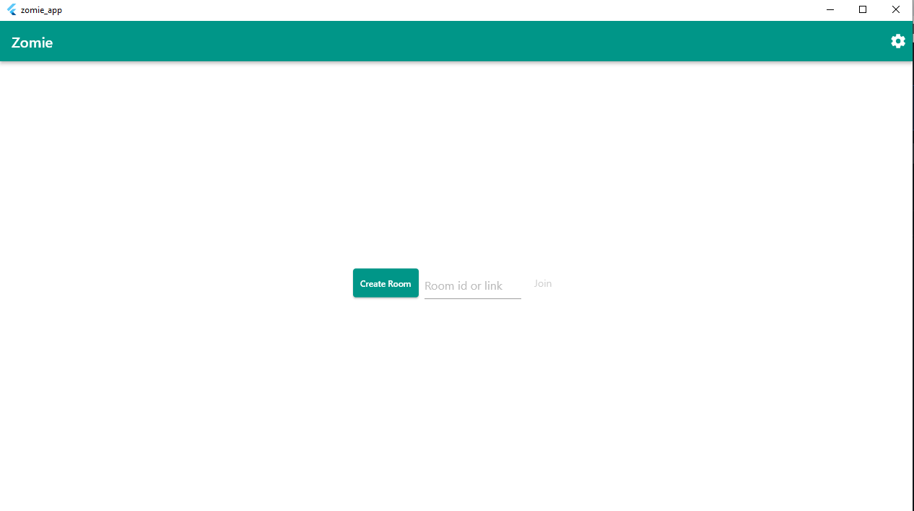
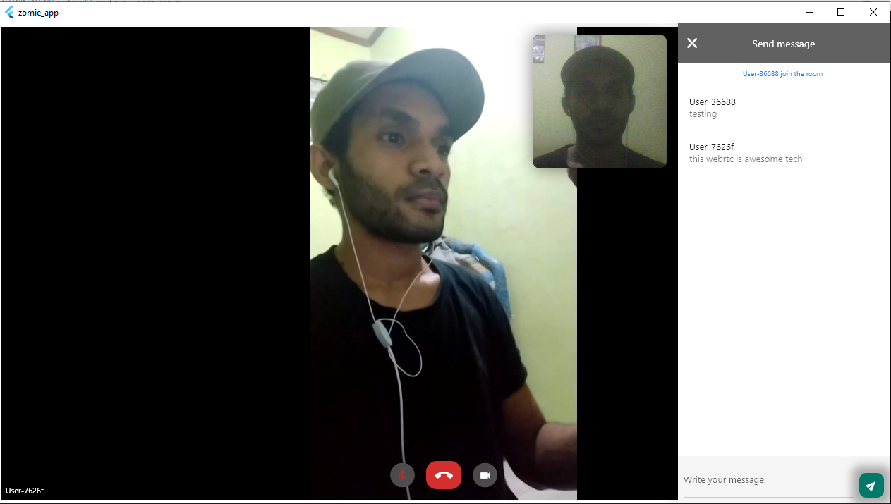
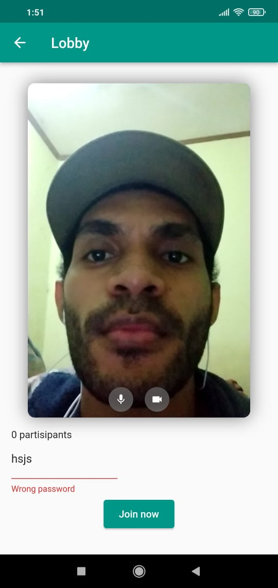
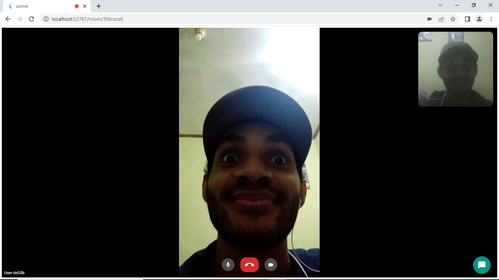
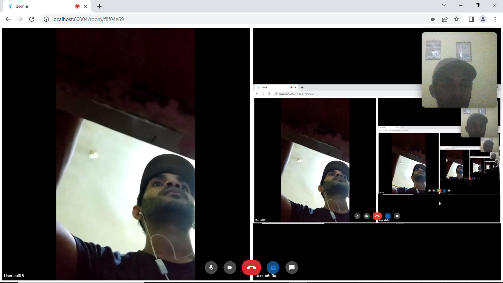
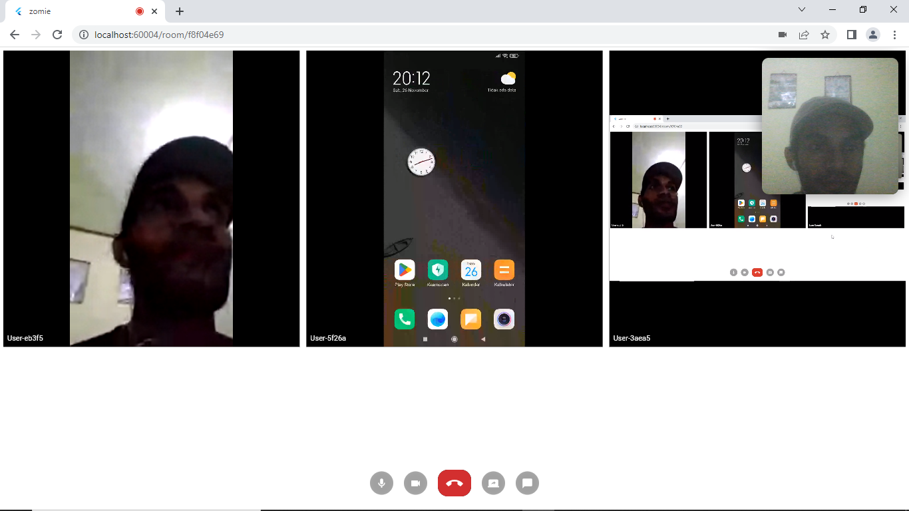

# zomie
:heavy_exclamation_mark: the project continues on branch 1peer :heavy_exclamation_mark:

Online meeting app like google meet, build with flutter for all platforms.
this app uses <a href="https://webrtc.org">WebRTC</a> for media real-time communication, and <a href="https://socket.io">socket.io</a> for signaling & messaging.
<a href="https://github.com/Mamena2020/zomie-server"> Server<a> running on nodejs with SFU architecture which features the following data transmission processes between the media server and the endpoints (client).

This app also using TURN Server as relays media, work as a backup plan if STUN Server won't work because client device behind of symmetric NAT. TURN server is already end-to-end encrypted by the peers and the TURN Server cannot decode/read the encrypted packet, it just relays the packet to other peers. By default TURN already setup in file (lib/Services/WebRTC/Config/WRTCConfig.dart)
using free TURN Servers from <a href="https://www.metered.ca/tools/openrelay/">OPEN RELAY</a>.
but you can add your own Turn server using <a href="https://github.com/Mamena2020/zomie-turn-server">Zomie TURN Server </a> as relays media.


- Features
  - Create Room 
     - life time (default 1 minute)
       - after life time & if there is no one in room, then room will destroy itself
     - password (optional)
  - Lobby
     - preparing for meeting
       - permission for microphone & camera
       - enter password (if required)
       - change user name
  - Room meeting
     - video & audio communication
        - muted/unmuted microphone
        - turn on/off camera
     - chat room
     - Screen share 
     - Pined layout
  - Settings
     - Bitrate
        - control video/screen bitrate in the room
     - Room Password 
        - allow/not 
     - Room life time
        - room life time after created  
  
- Tested platform status
  - :heavy_check_mark: Android (tested)
  - :heavy_check_mark: Web (tested)
  - :heavy_check_mark: Windows (tested)
     - :heavy_exclamation_mark: Screen share (not working yet) 
     - :heavy_exclamation_mark: WebCam light still on when camera turn off 
  - :heavy_exclamation_mark: Ios (not tested yet)
  - :heavy_exclamation_mark: Linux (not tested yet)
  - :heavy_exclamation_mark: Mac (not tested yet)
  
#SS Apps

- Desktop-windows



- Mobile-Android


- Web browser





#How to use
- create dotenv file
   - cmd: cp dotenv.example dotenv
   - fill in credentials, you can ignore (TURN_SERVER_HOST, TURN_SERVER_USERNAME, TURN_SERVER_PASSWORD), because by default its already setup, but its okay if you want to add more your own TURN server.
     ```
      MEDIA_SERVER_HOST = "localhost:5000"

      ALLOW_TURN_SERVER = "false" 
      TURN_SERVER_HOST = "turn:ip:port" #example: "turn:192.168.1.9:3478"
      TURN_SERVER_USERNAME = ""    #exampe: "zomie"
      TURN_SERVER_PASSWORD = "" #example: "password"

     ```

- android config
   - change "applicationId" 
     - dir: (android/app/build.gradle) 
     ```
      defaultConfig {
        // TODO: Specify your own unique Application ID (https://developer.android.com/studio/build/application-id.html).
        applicationId "com.example.zomie_app"
     ```
- build
   - web
      - canvas kit: flutter build web --web-renderer canvaskit --release
      - html render: flutter build web --web-renderer html --release
   - android (APK)
      - flutter build apk --release             
   - desktop windows
      - flutter build windows
- run debug
   - web
      - flutter run -d chrome
   - android
      - flutter run -d android
   - desktop
      - flutter run -d windows

#Flutter info

- build with version.
  - Flutter 3.3.4, dart 2.18.2
- Android 
  - targetSdk
    ```
      compileSdkVersion 33
      minSdkVersion 23
      targetSdkVersion 33
    ```

# Note

- WebRTC
  - Support Platform
     - All Platform
  - STUNT/TURN server
     - STUNT:  "urls": "stun:stun.stunprotocol.org"
        - Stunt will not working if client is under symmetric NAT. 
     - TURN: by default TURN server using from <a href="https://www.metered.ca/tools/openrelay">Open Relay</a>, or you can add more using <a href="https://github.com/Mamena2020/zomie-turn-server">Zomie TURN Server </a>


- Socket io  
  - Platform
    - All Platform
  - version match info [1]
    ```
      - server(nodejs): "socket.io": "^2.4.1"
      - client(flutter):  socket_io_client: ^1.0.1 | ^1.0.2
    ```
  - version match info [2]
    ```
      - server(nodejs): "socket.io": "^4.5.3"
      - client(flutter):  socket_io_client: ^2.0.0
    ```

  
 


# References

- Socket Io
  - Issues
    - https://stackoverflow.com/questions/68058896/latest-version-of-socket-io-nodejs-is-not-connecting-to-flutter-applications

- WebRTC 
  - Articles | Doc
    - https://developer.mozilla.org/en-US/docs/Web/API/MediaDevices/getUserMedia
    - https://bloggeek.me/webrtc-vs-zoom-video-quality/
    - https://bloggeek.me/webrtcglossary/rtp/
    - https://webrtchacks.com/zoom-avoids-using-webrtc/
    - https://stackoverflow.com/questions/56944864/can-we-remove-and-add-audio-stream-dynamically-in-webrtc-video-call-without-rene
    - https://stackoverflow.com/questions/64012898/how-to-completely-turn-off-camera-on-mediastream-javascript
    - bandwidth
       - https://webrtc.github.io/samples/src/content/peerconnection/bandwidth/
       - https://stackoverflow.com/questions/57653899/how-to-increase-the-bitrate-of-webrtc
       - https://webrtchacks.com/limit-webrtc-bandwidth-sdp/
       - https://stackoverflow.com/questions/16712224/how-to-control-bandwidth-in-webrtc-video-call
  - Issues
    - https://github.com/flutter-webrtc/flutter-webrtc/issues/938 windows rtc
    - https://github.com/flutter-webrtc/flutter-webrtc/issues/436 close conection
    - media stream, muted, stop camera
       - https://stackoverflow.com/questions/63666576/how-restart-a-closed-video-track-stopped-using-userstream-getvideotracks0
       - https://stackoverflow.com/questions/57563002/do-cloned-streams-from-mediastreamdestination-are-still-somehow-bound-to-this-au
       - https://stackoverflow.com/questions/72857922/replace-webrtc-track-of-different-kind-without-renegotiations
       - https://stackoverflow.com/questions/41309682/check-if-selected-microphone-is-muted-or-not-with-web-audio-api/41309852#41309852
       - https://stackoverflow.com/questions/56944864/can-we-remove-and-add-audio-stream-dynamically-in-webrtc-video-call-without-rene
       - https://stackoverflow.com/questions/39831238/webrtc-how-to-change-the-audio-track-for-a-existing-stream
       - https://stackoverflow.com/questions/64012898/how-to-completely-turn-off-camera-on-mediastream-javascript
      
- Flutter Code 
  - App Life Cycle 
    - https://www.reddit.com/r/FlutterDev/comments/l7wqb2/flutter_tutorial_detect_app_background_app_closed/
